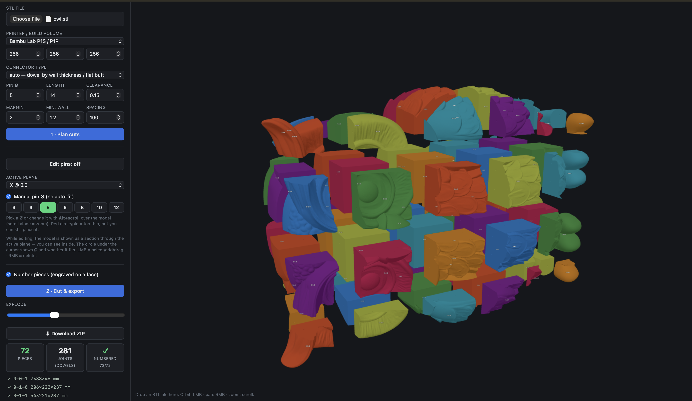
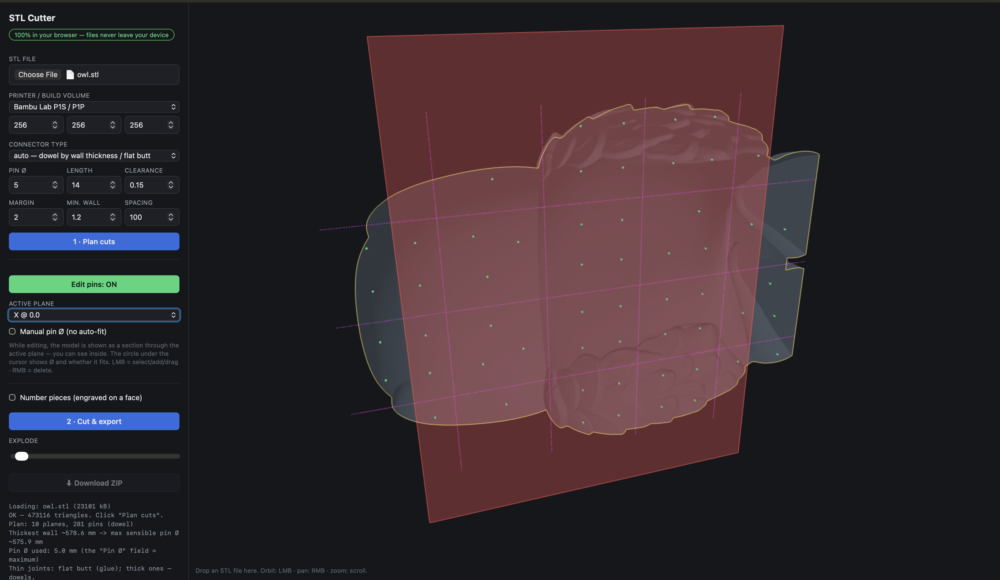

# STL Cutter

**Cut models that are bigger than your print bed into pieces that fit — right in your browser — with auto-generated dowel-pin joints to glue them back together.**

**100% client-side.** Your model never leaves your machine: no upload, no account, no server.

> **[▶ Live demo](https://gluhy.github.io/splitSTL/)** · works in any modern browser (Chrome/Edge/Firefox/Safari)



---

## Why

You found a great big model, but it's taller than your printer. The usual fix — hacking it apart in Blender/Meshmixer and adding alignment pins by hand — is fiddly. **STL Cutter** does it in a few clicks: drop in an STL, it slices the model to your bed size and drops in dowel pins so the parts line up and glue together cleanly.

## Workflow

1. **Drop in an STL** (or pick a file).
2. **Plan cuts** — it splits the model to your printer and auto-places dowel pins.
3. *(optional)* **Edit pins** — add / move / delete / resize pins on a live section view.
4. **Cut & export** — boolean cut + joints, then **Download ZIP** (one STL per piece).

## Screenshots



## Features

- **Printer presets** — Bambu Lab (A1 / P1 / X1 / H2D), Prusa, Ender 3, Voron, or a custom build volume.
- **Automatic slicing** — splits the model along X/Y/Z so every piece fits the bed (minus margin).
- **Dowel joints** — auto-places **perpendicular** pins on each seam so the parts slide together and align. Pin Ø is auto-fitted to wall thickness; seams too thin for a pin fall back to a flat glue joint.
- **Interactive 3D pin editing** — toggle edit mode to add / move / delete pins on the active cut plane. The model is shown as a **live section** through that plane (with the real cross-section outline), so you can see inside. A **ghost circle under the cursor** previews the pin Ø, direction and whether it fits (green = fits, red = too thin). Pin size is auto-fitted by default, or switch to **manual Ø** — quick-size chips, a slider, or **Alt+scroll** over the model — to mix sizes freely.
- **Disconnected bodies are split automatically** — if one bed-sized cell ends up holding separate, non-touching parts, each becomes its own piece (and its own number), so nothing gets bundled into a single confusing STL.
- **Piece numbering** (optional) — engraves each piece's grid index (e.g. `0-1-2`) as a 3×5 matrix of self-supporting square-pyramid dimples on a cut face, placed only where there's actually material and auto-oriented so it lands on the part. The readable number is also shown floating in the 3D view.
- **Exploded view + stats** — spread the pieces apart; stat boxes show piece count, joint count and numbering status; each piece gets a "fits / too big" check. Hover a piece in the list to highlight its number, click to center the camera on it.
- **Mesh auto-repair + diagnostics** — welds duplicate vertices, drops degenerate/duplicate triangles, fills small holes. If a mesh still isn't a valid 2-manifold, it tells you *why* (boundary edges / non-manifold edges / flipped normals) instead of failing cryptically.
- **Hover help** on every setting — tooltips explain what each option does.
- **ZIP export** — one binary STL per piece.

## How it works

1. The model is converted to a watertight `manifold-3d` solid (with auto-repair).
2. A signed-distance field (via a BVH) measures wall thickness around the seams.
3. Cut planes are spaced so each resulting cell fits the build volume.
4. Perpendicular dowel pins are placed where a straight pin fully fits the material, kept clear of where perpendicular cuts intersect.
5. Cutting + pin holes/plugs are done with boolean ops; disconnected bodies are separated; each piece is exported as STL.

## Tech

- [three.js](https://threejs.org/) — rendering, STL load/export
- [manifold-3d](https://github.com/elalish/manifold) — robust boolean cutting (WASM)
- [three-mesh-bvh](https://github.com/gkjohnson/three-mesh-bvh) — signed-distance sampling for pin fitting
- [fflate](https://github.com/101arrowz/fflate) — ZIP packing
- [Vite](https://vitejs.dev/) — dev server & build

## Run locally

```bash
npm install
npm run dev      # open the printed localhost URL
```

Build a static bundle (deployable to GitHub Pages, Netlify, etc.):

```bash
npm run build
npm run preview
```

## Limitations

- The input must be a **watertight 2-manifold**. Auto-repair handles minor defects (duplicate verts, small holes); heavily broken meshes (self-intersections, many non-manifold edges) need an external pass first — e.g. Blender's **Voxel Remesh**, Meshmixer **Make Solid**, or Netfabb / slicer "repair".
- Boolean ops run on the main thread, so very large meshes (≫1M triangles) will briefly freeze the UI during the cut. Decimate first if needed.

## License

[MIT](LICENSE)
