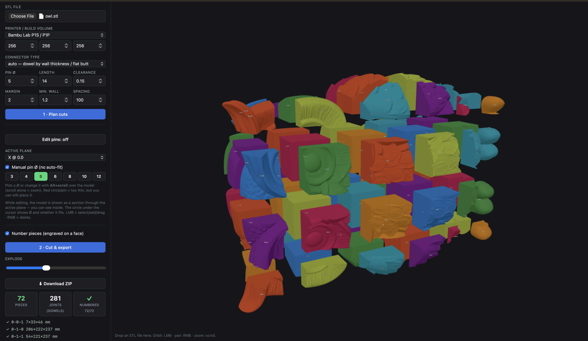
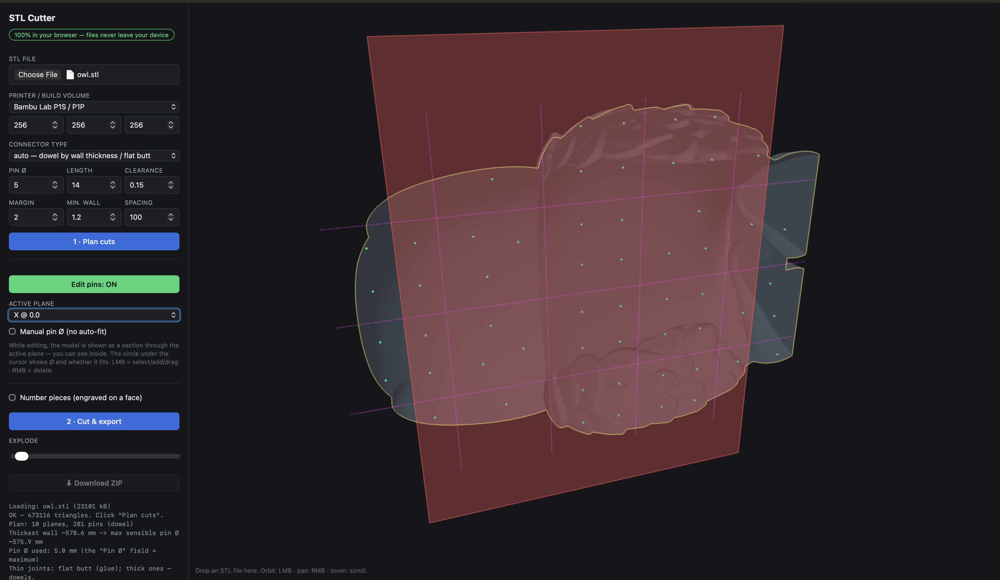

# STL Cutter

**Cut models that are bigger than your print bed into pieces that fit — right in your browser — with auto-generated dowel joints, and the dowels themselves exported as an STL to print.**

**100% client-side.** Your model never leaves your machine: no upload, no account, no server.

> **[▶ Live demo](https://gluhy.github.io/splitSTL/)** · works in any modern browser (Chrome/Edge/Firefox/Safari)



---

## Why

You found a great big model, but it's taller than your printer. The usual fix — hacking it apart in Blender/Meshmixer and adding alignment pins by hand — is fiddly. **STL Cutter** does it in a few clicks: drop in an STL, it slices the model to your bed size and drops in dowel pins so the parts line up and glue together cleanly.

## Workflow

1. **Drop in an STL** (or pick a file).
2. **Plan cuts** — it splits the model to your printer and auto-places dowel pins.
3. *(optional)* **Move the cut planes** — drag a seam in the 3D view to hide it in a crease instead of taking the even split; the pins on it are re-placed.
4. *(optional)* **Edit pins** — add / move / delete / resize pins on a live section view.
5. **Cut & export** — boolean cut + joints, then **Download ZIP** (one STL per piece, plus one STL per dowel size holding every dowel you need).

## Screenshots



## Features

- **Printer presets** — Bambu Lab (A1 / P1 / X1 / H2D), Prusa, Ender 3, Voron, or a custom build volume.
- **Automatic slicing** — splits the model along X/Y/Z so every piece fits the bed (minus margin).
- **Seams where the part is thickest** (optional) — an even split lands wherever it lands, sometimes right on a waist where no dowel fits at all. Switch it on and each seam slides inside a window around its even position to the cross-section carrying the most material: more glue area, room for fatter dowels, same piece count. Pieces come out less uniform in length, and every one is still checked against the bed.
- **Dowel joints** — auto-places **perpendicular** pins on each seam so the parts slide together and align. Each pin gets the largest Ø that fits where it is tightest along its whole length; seams too thin for any pin fall back to a flat glue joint. Pins are spread evenly by diameter class, so seams of the same shape get the same joint.
- **The dowels are printed too** — no need to source rods. Every dowel is written to `pins_<Ø>mm_x<n>.stl`, laid out on the plate standing on end, chamfered both ends and **fluted** — longitudinal grooves give the glue somewhere to go instead of being scraped off on the way in (wooden dowels are fluted for the same reason). Oversized batches are split across as many plates as it takes to fit the bed. Holes are drilled 0.5 mm deeper per side so the two faces meet instead of the pin bottoming out, with a lead-in chamfer as wide as the spare wall allows.
- **Movable cut planes** — the even split is rarely where you want the seam. Click a plane to work on it, drag it to move that cut (Shift+drag for fine control); it is clamped so every piece still fits the bed, and the pins on that seam are re-placed automatically.
- **Interactive 3D pin editing** — toggle edit mode to add / move / delete pins on the active cut plane. The model is shown as a **live section** through that plane (with the real cross-section outline), so you can see inside. A **ghost dowel** follows the cursor at its real Ø and length, so you see how far it reaches into both pieces and whether it fits (green = fits, red = too thin). Click to add, drag to orbit the camera, drag a pin to move it, **Del** to delete, **Ctrl+Z / Ctrl+Shift+Z** to undo / redo. Pin size is auto-fitted by default, or switch to **manual Ø** — quick-size chips, a slider, or **Alt+scroll** — to mix sizes freely.
- **Chamfered seams** (optional) — a hairline glue joint has nowhere for filler to go: it sits proud of the surface and sands straight off. Switch this on and the outer edge of every cut face gets a 45° chamfer, so the assembled seam is a V-groove the filler can flow into and be sanded flush. It is one continuous face, not a stack of steps, and it holds onto the wall even where the wall leans away from the cut, so both pieces get the same groove. The groove only follows the line where a seam actually meets the model's outer wall — a cut face that ends up glued against another piece stays flat. Where a wall is too thin to spare it the chamfer eases off along the seam instead of cutting the joint through, except at a feather edge, where the wall runs out to nothing: there the groove keeps its size and takes the tip with it, rather than stopping short of the corner. The 45° flare also prints without support when the piece stands on its cut face.
- **Print orientation** — each exported piece is rotated so its biggest cut face lies on the bed: flat first layer, dowel holes printing straight up, nothing to support on the seam. The 3D view stays assembled; the rotation is applied when the STL is written. Turn it off with one checkbox.
- **Disconnected bodies are split automatically** — if one bed-sized cell ends up holding separate, non-touching parts, each becomes its own piece (and its own number), so nothing gets bundled into a single confusing STL.
- **Piece numbering** (optional) — engraves each piece's grid index (e.g. `0-1-2`) as a 3×5 matrix of square-pyramid dimples with 45° walls (self-supporting whichever way the face prints), placed only where there's actually material. A lone dot set apart on the baseline marks where the number starts: the label lands on whichever cut face has room, so a loose piece gives no clue which way is up, and read the wrong way round `0-5-8` is a perfectly plausible `8-5-0`. Turn the piece until that dot is at the bottom left, then read. By default it goes only on a cut face — glued and hidden, never the model's outer wall — and the face lying on the bed is used only as a last resort. The readable number is also shown floating in the 3D view.
- **Exploded view + stats** — spread the pieces apart; stat boxes show piece count, joint count and numbering status; each piece gets a "fits / too big" check. Hover a piece in the list to highlight its number, click to center the camera on it.
- **Mesh auto-repair + diagnostics** — welds duplicate vertices, drops degenerate/duplicate triangles, fills small holes. If a mesh still isn't a valid 2-manifold, it tells you *why* (boundary edges / non-manifold edges / flipped normals) instead of failing cryptically.
- **Hover help** on every setting — tooltips explain what each option does.
- **ZIP export** — one binary STL per piece, plus the dowel stock.

## How it works

1. The model is converted to a watertight `manifold-3d` solid (with auto-repair).
2. A signed-distance field (via a BVH) measures wall thickness around the seams.
3. Cut planes are spaced so each resulting cell fits the build volume.
4. Perpendicular dowel pins are placed where a straight pin fully fits the material, kept clear of where perpendicular cuts intersect, and spread from the middle of each seam outwards so equivalent seams get equivalent joints.
5. Cutting + pin holes/plugs are done with boolean ops; disconnected bodies are separated; each piece is exported as STL.
6. The optional seam chamfer is the seam line — the boundary of the whole model's cross-section at the plane — swept with a 45° bicone whose radius follows the wall thickness there (measured across to the wall facing back, so corners are not mistaken for thin material), subtracted from the two pieces that share the seam.

## Tech

- [three.js](https://threejs.org/) — rendering, STL load/export
- [manifold-3d](https://github.com/elalish/manifold) — robust boolean cutting (WASM)
- [three-mesh-bvh](https://github.com/gkjohnson/three-mesh-bvh) — signed-distance sampling for pin fitting
- [fflate](https://github.com/101arrowz/fflate) — ZIP packing
- [Vite](https://vitejs.dev/) — dev server & build

## Run locally

```bash
npm install
npm run dev      # open the printed localhost URL
```

Build a static bundle (deployable to GitHub Pages, Netlify, etc.):

```bash
npm run build
npm run preview
```

## Limitations

- The input must be a **watertight 2-manifold**. Auto-repair handles minor defects (duplicate verts, small holes); heavily broken meshes (self-intersections, many non-manifold edges) need an external pass first — e.g. Blender's **Voxel Remesh**, Meshmixer **Make Solid**, or Netfabb / slicer "repair".
- Boolean ops run on the main thread, so very large meshes (≫1M triangles) will briefly freeze the UI during the cut. Decimate first if needed.

## License

[MIT](LICENSE)
